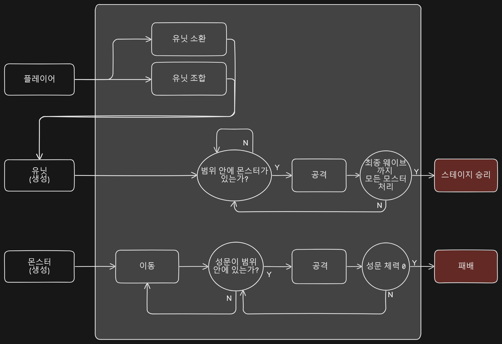

# 필수 기능 가이드 (요구사항/체크 리스트)
---
### 1. 단순 행동 패턴 2가지 구현
- 공격하기, 도망치기 > 소환, 조합

### 2. 플레이어 클래스에서 플레이어 스탯 (공격력, 체력 등) 관리하기
- 성에 공격력을 만들까? (생가중)

### 3. 간단한 전투 로직 구현
- 플레이어 공격, 몬스터 피격 > 유닛 공격, 몬스터 피격 대체

### 4. 스테이지 클리어 시 유저 체력 회복
- '유저' > '성문'

### 5. 스테이지의 진행과 비례해서 몬스터의 체력과 공격력 증가 시키기
- 상위 등급의 몬스터 출현 조건과 등장 확률 증가

<!-- ### 필수 기능 공통 가이드
1. **switch 분기문**을 사용하여 유저의 각 행동에 대한 로직을 처리해보세요.
2. **while 반복문**을 사용할 때는 **종료 조건이 무조건** 있어야 합니다.
    1. 스테이지 클리어 및 게임 종료 조건
    2. 몬스터와의 전투 종료 조건
3. **Math.random()** 메서드를 통해서 랜덤한 숫자를 얻을 수 있습니다.
4. 플레이어의 공격은 선택에 의해서 이루어지지만, 몬스터의 공격은 자동으로 처리가 된 뒤 해당 플레이어의 로그에 보여지게 됩니다.
5. 함수의 호출 순서에 따라서 각 변수, 객체들을 관리하는 것이 중요합니다. -->


# 게임 기획 및 분석
---

로그라이크 특징 3가지
- ‘랜덤 요소, 세이브 불가능, 턴제’ 

로그라이크 텍스트게임(CLI)
- ‘턴제 디펜스 게임’ 

**전투 기획**
1. 플레이어에게는 여러 가지 선택지가 주어진다.
    1. 유닛소환 - '근접, 원거리, 버퍼' 중 선택
    2. 조합 - 유닛을 조합한다 (확률).
    3. 아이템 - 보유하고 있는 아이템을 선택해서 사용한다.
    4. 수리 - 성문의 내구도를 일정량 회복한다 (횟수 제한).
2. (보류) 유닛의 공격력은 최소공격력과 최대공격력이 존재하며, 최소공격력은 정수이고 최대공격력은 플레이어가 가지고 있는 최대 공격력 배율에 따라 달라진다. 
3. 스테이지별 웨이브가 존재하며 웨이브마다 몬스터가 출현.
    - 스테이지당 10 웨이브
    - 5턴당 1웨이브 진행
4. 스테이지 승리 / 패배
    1. 승리 : 10웨이브까지 모든 몬스터 소멸.
    2. 패배 : 성의 내구도가 0이 되면 패배.  
5. 스테이지 클리어 시, 성문 체력이 일정수치 회복된다.
<!-- 3. 스테이지 클리어 시, 아래의 능력치 중 하나가 정해진 수치내에서 랜덤으로 증가한다. 증가하는 능력치는 아래와 같다.
    - 체력 20~50
    - 최소 공격력 5~20
    - 최대 공격력 배율 (0.1 ~ 1)
    - 크리티컬 공격 확률 3~7 -->
6. 스테이지가 진행될 수록 상위 등급의 몬스터가 출현하며 소환될 확률 또한 증가한다.
7. 기본 전투형태는 턴제 형식으로 진행된다.
    플레이어의 선택 > 유닛의 행동 > 몬스터 행동  

<추가 계획: 개발 완료되고 여유되면 Try~>  
몬스터 처치시 일정 금화 획득.  
스테이지 종료 후 상점 화면 (금화소비). 

**유닛**
1. 속성
    - type (유형) : 근거리, 원거리, 버퍼
    - grade (등급) : 1~3등급 
    - damage (공격력) : 등급에 따라서 상승.
    - critical (크리티컬 확률) : 등급에 따라서 상승

2. 종류
    - 근접 : 범위1, 공격력2
    - 원거리 : 범위3, 공격력1
    - 버퍼A : 아군 전원에게 n만큼의 '공격력'을 증가 시킨다.
    - 버퍼B : 아군 전원에게 n만큼의 '크리티컬 확률'을 증가 시킨다.

3. 조합
    - 근접 유닛 조합 : 같은 등급의 근접 유닛 n마리를 소모하여 상위 등급의 근접 유닛을 1개 생성 (확률).
    - 원거리 유닛 조합 : 같은 등급의 원거리 유닛 n마리를 소모하여 상위 등급의 원거리 유닛을 1개 생성 (확률).
    - 무작위 조합 : 무작위로 같은 등급의 유닛 n마리를 소모하여 랜덤한 종류의 상위 등급 유닛을 1개 생성 (확률).

**몬스터**
1. 속성
    - type (유형) : Nomal, Boss
    - grade (등급) : A ~ F (스테이지가 올라갈 수록 높은 등급의 몬스터 소환)
    - name (이름) : 고블린 오우거 트롤 등등...
    - hp (체력) : 몬스터 HP
    - att_type (공격타입) : 근거리 or 원거리

2. 종류
    - 일반 : 근거리 5종류 / 원거리 5종류
    - 보스 : 근거리 1종류 / 원거리 1종류

**아이템 or 인벤토리(?)**
1. 속성
    - id (아이템 종류)
    - count (수량) : 소지수량
    - Desc : 설명

2. 종류
    - 버프 스톤 : 배치된 모든 유닛에게 n턴간 최소 공격력을 n만큼 증가 시킨다.
    - 마법의 두루마리 : 몬스터 전체에게 1~n의 데미지를 준다.
    - 포탄 : 몬스터 한마리에게 강력한 데미지를 준다.
 

# Game Process
---




```markdawn
레이싱/턴제
ㅁㅁㅁㅁㅁㅡㅡㅡ
ㅁㅁㅁㅁㅁ|    |
ㅁㅁㅁㅁㅁ|    |
ㅁㅁㅁㅁㅁ|    |
ㅁㅁㅁㅁㅁ|    |
ㅁㅁㅁㅁㅁ|___ㅣ
```